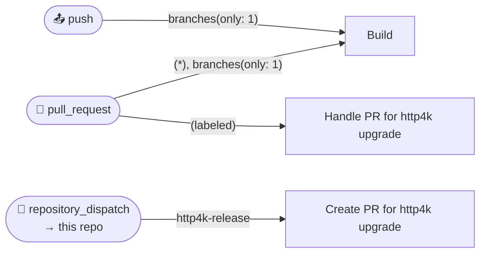

# Workflows

```mermaid
flowchart LR
    push(["📤 push"])
    pullrequest(["🔀 pull_request"])
    buildyml["Build"]
    createprforhttp4kupgradeyml["Create PR for http4k upgrade"]
    handleprforhttp4kupgradeyml["Handle PR for http4k upgrade"]
    repositorydispatchgithubrepository(["🔔 repository_dispatch<br/>→ this repo"])
    push -->|"branches(only: 1)"|buildyml
    pullrequest -->|"(*), branches(only: 1)"|buildyml
    pullrequest -->|"(labeled)"|handleprforhttp4kupgradeyml
    repositorydispatchgithubrepository -->|"http4k-release"|createprforhttp4kupgradeyml
```

## Workflows

- [Build](./build/)
- [Create PR for http4k upgrade](./create_pr_for_http4k_upgrade/)
- [Handle PR for http4k upgrade](./handle_pr_for_http4k_upgrade/)